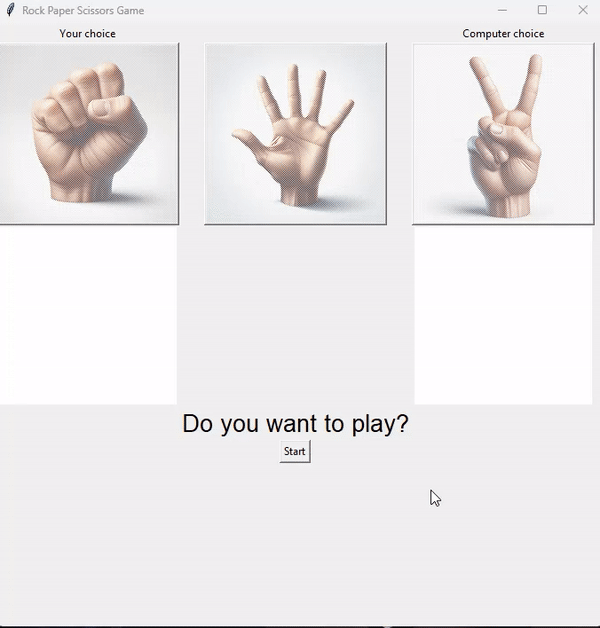

# Rock Paper Scissors Game

A simple rock, paper, scissors game using Tkinter.




## Description

This is a straightforward implementation of the classic rock, paper, scissors game using Python's Tkinter library. The game allows you to play against the computer, making a choice between rock, paper, or scissors. It then displays the result of the match, whether you win, lose, or tie against the computer.

## Getting Started

1. Clone the repository:
    ```bash
        git clone https://github.com/quangvo90/rock_paper_scissors_game.git
    ```

2. Navigate to the project directory:
    ```bash
        cd rock_paper_scissors_game
    ```

3. macOS only - Install dependencies (optionally in a virutal env):

    - See [python docs](https://packaging.python.org/en/latest/guides/installing-using-pip-and-virtual-environments/#creating-a-virtual-environment) for support on installing `venv` if your installation is missing the module.

    
    ```bash
        # optional use of virtual env
        python3 -m venv venv
        source ./venv/bin/activate
    ```

    - use `pip` and `brew` to install dependencies missing on macOS in some cases.

    ```bash
        pip install pillow
        brew install python-tk
    ```

4. Run the game:
    ```bash
        python rock_paper_scissors.py
    ```

## Gameplay

- Click on one of the buttons (Rock, Paper, or Scissors) to make your choice.
- The computer will also make a random choice.
- The result of the match will be displayed, indicating whether you win, lose, or tie.
